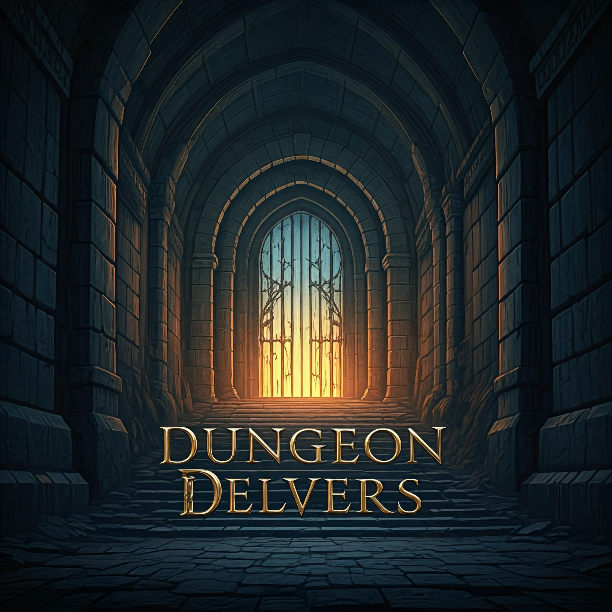

# 

A 3D MMO RPG game built with BabylonJS, SocketIO!

## 🕹️ Testing

A demo will be available soon!

## 💻 Running

To run the game locally run the following commands:

1. `git clone git@github.com:mealeyst/dungeon_delvers.git`
2. `cd dungeon_delvers`
3. 'npm install`
4. 'npm start`

This should load up a local development server that you can hit at http://localhost:1234/

## 📕 Features

- Full 3D world brought to you by the wonderful team over at [BabylonJS](https://www.babylonjs.com/)
- A full fleged browser based MMO
  - The following races planned as a proof of concept:
    - Human
    - Dwarf
    - Orc
    - Goblin
  - The following Arctypes as a proof of concept:
    - Fighter
    - Scout
    - Mage
    - Healer

## Licenses

This project is under the [ISC](https://github.com/mealeyst/dungeon_delvers/blob/main/LICENSE) license.